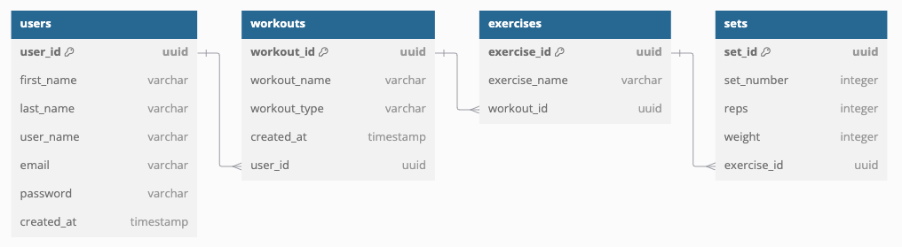

# Project Details

## Project Description

Workout-logger is a web application designed to help users set fitness goals, input their workouts in real-time, and keep a history of all their workouts. This application will implement a three-tier architecture which includes the client, server, and database. 

## Functional Requirements

- **User Registration:** Allow users to sign up with email and password.
- **User Login:** Allow users to log in securely with their credentials.
- **Profile Management:** Allow users to update personal information, such as name, email, and profile picture.
- **Password Management:** Provide functionality to reset or change passwords.
- **Workout Entry:** Allow users to log workouts with details like:
   - Date
   - Workout name
   - Workout type
- **Workout History:** Enable users to view their workout history in a chronological list.
- **Data Editing:** Provide the ability to edit or delete logged workouts.
- **Graphs:** Visualize progress toward goals using numeric data.
- **Exercise Entry:** Allow users to log exercises, **within Workout Entry**, with details like:
  - Exercise name
  - Sets, reps, and weight
- **Goal Setting:** Enable users to set goals.
- **User Management:** Allow administrators to view, edit, or delete user accounts if needed.
- **Exercise Management:** Allow administrators to manage the default exercise database, including adding, updating, or removing entries.
- **Secure Authentication:** Implement secure methods like OAuth and JWT for user authentication.

## Non-functional Requirements
- **Response Time:** All user interactions, such as viewing workout logs or submitting a new workout entry, should have a response time of under 2 seconds.
- **Scalability:** The application should handle increased user traffic without significant performance degradation.
- **Data Handling:** The system should efficiently manage and query large datasets of workout logs.
- **User Interface:** Provide an intuitive and visually appealing interface optimized for both beginners and advanced users.
- **Cross-Platform Support:** The application should function seamlesslly across different devices (desktop, tablet, and mobile) and browsers.
- **Code Quality:** Adhere to coding standards and best practices to ensure code readability and maintainability.
- **Modular Design:** Structure the system into loosely coupled, highly cohesive modules for easier updates and debugging.
- **Documentation:** Maintain comprehensive documentation for developers (e.g., API docs) and users (e.g., FAQs, help guides).
- **Vertical and Horizontal Scaling:** Design the system to scale efficiently by adding resources or new instances.

## Database Diagram

